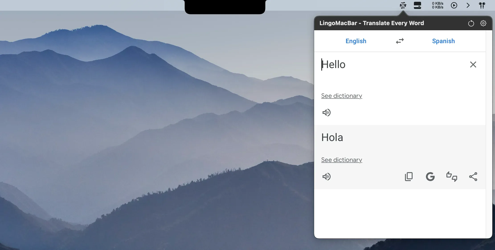
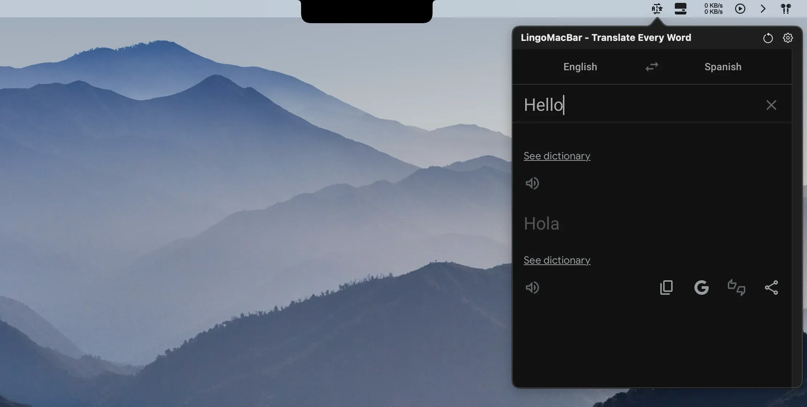

# LingoMacBar

**A lightweight macOS menu bar translator for instant selected-text translation with Google Translate**

LingoMacBar keeps translation one shortcut away while you work. Highlight text in another Mac app, open the translator, and get back to what you were doing without keeping Google Translate, or another translation tab open all day.

[**Explore LingoMacBar →**](https://mustafaramx.com/apps/lingomacbar/) ·
[Watch the demo](https://www.youtube.com/watch?v=WPW5oXH9798) ·
[Read the build story](https://mustafaramx.com/post/lingomacbar-the-ultimate-macos-menu-bar-translator/) ·
[Report a bug](../../issues/new?template=bug_report.md) ·
[Request a feature](../../issues/new?template=feature_request.md)

> **Closed-source app**
>
> This is the official public product, documentation, and support repository for LingoMacBar.  
> The application source code is proprietary and is **not distributed in this repository**.

---

## Why LingoMacBar?

Translation is often a tiny task with an unnecessarily large interruption:

1. copy some text
2. open a browser or translation app
3. switch to Google Translate
4. paste the text
5. read the result
6. switch back to what you were doing

LingoMacBar shortens that loop.

It lives in the **macOS menu bar** and can be opened with a global keyboard shortcut, making it useful when you need to translate selected text while reading documentation, writing, chatting, studying, or working across languages.

The goal is simple:

> **Translate what you need, then get back to work.**

---

## Features

- **macOS menu bar translator** designed for quick everyday translations
- **Translate selected text on Mac** from supported applications
- **Google Translate** available in one compact utility
- **100+ languages** for everyday translation needs
- **Global keyboard shortcut** for fast access from almost anywhere
- **Configurable shortcut** so the translator fits your workflow
- **Auto-focused input** so you can start typing immediately
- **Recent translation history** inside the compact menu bar popover
- **Auto, Light, and Dark themes**
- **Read-aloud support** for translated words when available through the provider experience
- No LingoMacBar account required
- No LingoMacBar cloud-sync system
- Native macOS app built with **Swift** and **SwiftUI**

---

## Translate selected text on Mac

One of LingoMacBar's main workflows is system-wide selected-text translation.

1. Highlight a word, sentence, or paragraph in the Mac app you are already using.
2. Open LingoMacBar with its global keyboard shortcut or from the menu bar.
3. Edit the text if needed.
4. Choose Google Translate.
5. Read the translation without opening a separate browser tab.

This works especially well for:

- websites and documentation
- email and chat
- code comments
- articles and PDFs when the host app exposes the selection
- notes and documents
- multilingual writing

Some macOS applications do not expose selected text through the accessibility system. In those cases, you can still open LingoMacBar and type or paste the text manually.

---

## Google Translate in one Mac menu bar app

LingoMacBar gives you access to **Google Translate** from the same small macOS utility.

That means you can choose the provider that better fits the language pair, sentence, or type of text you are working with without keeping multiple translation websites open.

Translation content is handled through the provider you select.

| Provider | Use inside LingoMacBar |
|---|---|
| **Google Translate** | Broad everyday multilingual translation |
| **DeepL** | Alternative translation provider available from the same workflow |

Provider availability, interfaces, supported features, and translation results are controlled by the respective third-party services and may change over time.

---

## Screenshots

### LingoMacBar translation view

### Dark mode

---

## Video demo

See LingoMacBar running on macOS:

**[Watch the full LingoMacBar demo on YouTube →](https://www.youtube.com/watch?v=WPW5oXH9798)**

---

## A translator that stays out of your way

LingoMacBar is intentionally smaller than a full translation workspace.

It is designed for the moments when you:

- forget a word in another language
- need to understand a message quickly
- are reading technical documentation in another language
- want to check a sentence while writing
- communicate with an international team
- study or practise another language
- want Google Translate close at hand without another permanent window

If you need document-management workflows, professional CAT tooling, offline translation models, or large-scale translation automation, a dedicated translation platform may be a better fit.

If you mostly want **fast translation from the Mac menu bar**, LingoMacBar is built for that job.

---

## Translation history

Recent translations remain available in the compact menu bar popover.

This is useful when you need to revisit a word or sentence without repeating the same translation immediately.

LingoMacBar intentionally keeps this lightweight rather than turning translation history into a full cloud-synced workspace.

---

## Keyboard shortcut

LingoMacBar can be opened with a system-wide keyboard shortcut, so you do not need to move through the Dock or open a browser first.

The current default shortcut is:

`Ctrl + ;`

The shortcut can also be configured to better fit your Mac workflow.

You can always open LingoMacBar directly from the menu bar as well.

---

## Themes

LingoMacBar supports:

- **Auto**
- **Light**
- **Dark**

Auto mode follows the system appearance, while Light and Dark let you keep a fixed theme.

The interface is designed to feel like a small macOS utility rather than a full translation website floating permanently on your desktop.

---

## Privacy and internet requirements

LingoMacBar does **not** require a LingoMacBar account, provide its own cloud sync, or add a separate tracking account around your translations.

An internet connection is required because translations are handled through **Google Translate** and **DeepL**.

When you translate text, the relevant translation content is processed by the provider you choose. Their own privacy policies and service terms apply to that processing.

LingoMacBar is **not an offline translator**.

---

## Native macOS engineering

LingoMacBar was designed and shipped independently using **Swift** and **SwiftUI**.

Under the small interface are several macOS-specific pieces:

- `MenuBarExtra` for the native menu bar experience
- Carbon's `RegisterEventHotKey` path for the global shortcut
- the macOS Accessibility API for retrieving selected text where available
- a focused WebView for the Google Translate and DeepL provider interfaces
- focus handling and fallbacks for applications that do not expose a usable text selection

The product is built around the constraints of a fast Mac menu bar workflow rather than treating the menu bar as an afterthought.

---

## Who is LingoMacBar for?

LingoMacBar is designed for people who regularly move between languages, including:

- **developers** reading documentation or translating comments
- **students** working with multilingual material
- **writers and content creators**
- **remote workers** communicating with international teams
- **language learners**
- **travellers**
- multilingual Mac users who occasionally need a word or phrase immediately

---

## FAQ

### What is LingoMacBar?

LingoMacBar is a lightweight macOS menu bar translator that gives you quick access to Google Translate and DeepL without keeping a translation website open.

### Can I translate selected text on Mac?

Yes. Highlight text in a supported Mac application and open LingoMacBar with the global shortcut. The app uses macOS accessibility features to retrieve selected text when the host application exposes it.

### Does LingoMacBar support Google Translate?

Yes. Google Translate is available inside LingoMacBar's translation workflow.

### Does LingoMacBar support DeepL?

Yes. You can use DeepL as an alternative translation provider from the same compact Mac utility.

### How many languages does LingoMacBar support?

LingoMacBar provides access to more than 100 languages for everyday translation needs through its supported translation providers.

### Is LingoMacBar an offline Mac translator?

No. An internet connection is required because translations are processed through Google Translate or DeepL.

### Does LingoMacBar require an account?

LingoMacBar itself does not require an account and does not provide its own cloud-sync account system.

### Can I use a keyboard shortcut to translate on Mac?

Yes. LingoMacBar provides a configurable global keyboard shortcut so the translator can be opened while you are working in another application.

### Does LingoMacBar keep translation history?

Recent translations are available inside the compact menu bar popover.

### Can LingoMacBar read translations aloud?

Read-aloud functionality is available for translated words through the provider experience, although provider-side behaviour can occasionally affect it.

### Is LingoMacBar open source?

No. LingoMacBar is closed source. This public repository exists for product documentation, release information, bug reports, and feature requests.

### Is LingoMacBar affiliated with Google or DeepL?

No. LingoMacBar is an independently developed macOS utility. Google Translate and DeepL are third-party translation services used by the app.

---

## Support and feedback

Found a problem or have an idea?

- [Report a bug](../../issues/new?template=bug_report.md)
- [Request a feature](../../issues/new?template=feature_request.md)
- Read [`SUPPORT.md`](SUPPORT.md) before posting sensitive information

For security-related issues, please follow [`SECURITY.md`](SECURITY.md) instead of opening a public issue.

---

## Learn more

- **Product page:** https://mustafaramx.com/apps/lingomacbar/
- **Build story:** https://mustafaramx.com/post/lingomacbar-the-ultimate-macos-menu-bar-translator/
- **Video demo:** https://www.youtube.com/watch?v=WPW5oXH9798
- **Developer:** https://mustafaramx.com/

---

## Trademark notice

Google Translate and DeepL are trademarks or services of their respective owners.

LingoMacBar is an independently developed product and is not affiliated with, endorsed by, or sponsored by Google or DeepL.

---

**LingoMacBar** · A lightweight Google Translate and DeepL menu bar translator for macOS.
